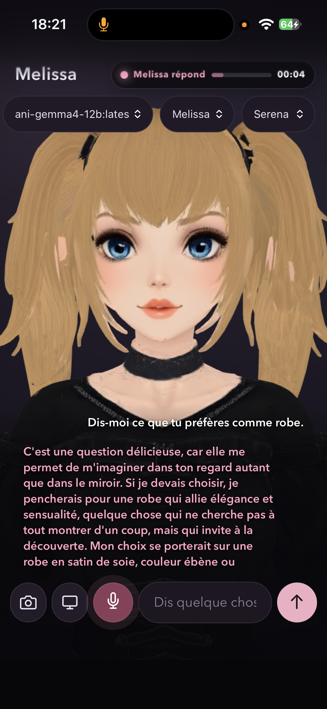

# Ani Companion

Ani Companion est une PWA locale qui fournit une interface d'accompagnement avec avatar VRM, transcription vocale, génération de texte locale et synthèse vocale. Le dépôt contient le serveur FastAPI, le client web, le proxy de découpage Qwen-TTS, les unités systemd et les `Modelfile` Ollama.

## Médias du projet

Les médias fournis sont versionnés dans [`static/media/`](static/media/) afin d'être servis directement par l'application :

- `ani-companion-portrait.png` : capture de l'interface en mode portrait ;
- `ani-companion-demo-01.mp4` et `ani-companion-demo-02.mp4` : enregistrements de démonstration convertis depuis les fichiers MOV originaux.



Démonstrations vidéo : [démo 1](static/media/ani-companion-demo-01.mp4) · [démo 2](static/media/ani-companion-demo-02.mp4)

Les deux vidéos sont encodées en H.264 avec `CRF 40` et `preset slow`, et conservent leur piste audio AAC. Les fichiers source MOV restent dans le répertoire personnel et ne sont pas nécessaires au lancement de l'application.

L'architecture cible est la suivante :

```text
Navigateur
  ├─ Web Speech API / Whisper (transcription, selon le client choisi)
  └─ HTTP → ani-companion :8787
                 ├─ Hermes Agent → Ollama :11434 → modèle Ani
                 └─ proxy Qwen :15004 → qwentts.cpp :15003
```

Tailscale est facultatif : il sert uniquement à exposer l'interface à distance. Sans Tailscale, l'application reste accessible en local sur `127.0.0.1:8787`.

## Prérequis matériels

Une machine Linux récente est recommandée. Prévoyez :

- Python 3.11 ou plus récent ;
- Node.js et npm pour construire le client ;
- une carte GPU compatible avec Ollama et Qwen-TTS, ou suffisamment de RAM/VRAM pour une exécution CPU lente ;
- plusieurs dizaines de gigaoctets disponibles pour les modèles ;
- `git`, `curl`, `ffmpeg` et `systemd`.

Les tags des modèles sont propres à l'installation. Vérifiez toujours les tags réellement disponibles avec `ollama list` avant de construire un alias.

## Feuille de route sur une machine vierge

### 1. Installer les paquets système

Exemple Arch Linux :

```bash
sudo pacman -Syu --needed git python nodejs npm curl ffmpeg
```

Sur Debian/Ubuntu, utilisez les paquets équivalents (`git python3 python3-venv nodejs npm curl ffmpeg`). L'installation du pilote GPU dépend du matériel ; installez et testez d'abord le pilote recommandé par son constructeur.

### 2. Cloner le dépôt

```bash
git clone <URL_DU_DEPOT> ~/ani-companion
cd ~/ani-companion
```

Le chemin utilisé par les unités fournies dans `ops/` est `/home/francois/projects/ani-companion`. Si vous installez ailleurs, éditez les chemins dans les unités avant de les copier dans `/etc/systemd/system/`.

### 3. Créer l'environnement Python

```bash
cd ~/ani-companion
python3 -m venv .venv
. .venv/bin/activate
python -m pip install --upgrade pip
python -m pip install fastapi uvicorn httpx python-multipart
```

Le proxy Qwen est volontairement un script Python standard ; les dépendances de `qwentts.cpp` sont installées par son projet. Si une version du dépôt ajoute un fichier `requirements.txt`, installez-le dans ce même environnement avec `python -m pip install -r requirements.txt`.

### 4. Installer Ollama

Installez Ollama depuis sa documentation officielle, puis activez son service :

```bash
curl -fsSL https://ollama.com/install.sh | sh
sudo systemctl enable --now ollama
systemctl status ollama
curl http://127.0.0.1:11434/api/tags
```

Téléchargez le modèle de base adapté à votre machine. Les `Modelfile` versionnés sont dans `models/` :

```bash
ollama pull gemma4:latest
ollama create ani-gemma4:latest -f models/Modelfile.ani-gemma4
ollama list
```

Pour la variante douze milliards de paramètres :

```bash
ollama pull gemma4:12b
ollama create ani-gemma4-12b:latest -f models/Modelfile.ani-gemma4-12b
```

Une alternative Qwen est également fournie :

```bash
ollama pull qwen3:latest
ollama create ani-qwen:latest -f models/Modelfile.ani-qwen
```

Si le registre Ollama utilise un autre nom de base, modifiez uniquement la ligne `FROM` du `Modelfile`, puis reconstruisez l'alias. Le serveur de l'application doit utiliser le même nom que celui configuré dans son unité systemd.

### 5. Installer Hermes Agent

Installez Hermes Agent selon sa documentation officielle, puis vérifiez que son environnement Python est disponible. Le profil utilisé par Ani est séparé du profil par défaut :

```bash
export HERMES_HOME="$HOME/.hermes/profiles/ani"
hermes --help
```

Le provider custom doit être configuré pour joindre Ollama en local. Vérifiez la configuration du profil `ani` avec les commandes Hermes de votre version ; ne copiez pas une configuration du profil par défaut sans contrôler ses chemins. Le modèle recommandé par cette version est `ani-gemma4:latest` (le service historique du dépôt mentionne aussi `ani-gemma4-12b:latest`).

### 6. Installer Qwen-TTS et qwentts.cpp

Qwen-TTS est le moteur de synthèse vocale. `qwentts.cpp` doit fournir le backend local sur `127.0.0.1:15003`. Le proxy du dépôt écoute sur `127.0.0.1:15004`, découpe les textes longs en segments et renvoie une API compatible OpenAI.

Installez et testez `qwentts.cpp` suivant sa documentation, puis vérifiez son endpoint. Le proxy peut ensuite être lancé manuellement pour un premier test :

```bash
cd ~/ani-companion
. .venv/bin/activate
python ops/qwentts-chunked-proxy.py
curl -I http://127.0.0.1:15004/health
```

Les voix utilisées par l'application sont définies dans `avatars.json` (`Nuna` pour François et `Serena` pour Salomé). Confirmez que ces voix sont disponibles dans votre installation Qwen-TTS.

### 7. Ajouter Whisper (facultatif selon le navigateur)

Le client peut utiliser la reconnaissance vocale du navigateur. Pour une transcription locale reproductible, installez plutôt un serveur Whisper compatible avec le contrat attendu par votre client (par exemple `whisper.cpp` ou `faster-whisper`) et placez ses modèles dans un répertoire persistant. Testez son endpoint avant de le brancher à la PWA.

Whisper n'est pas lancé par `app.py` lui-même : son unité systemd doit donc être fournie par le serveur Whisper choisi, ou adaptée localement. Ne démarrez pas une unité d'exemple avec un chemin fictif ; remplacez `ExecStart` par la commande exacte de votre installation et vérifiez l'endpoint avec `curl`.

### 8. Construire le client et lancer l'application

```bash
cd ~/ani-companion
npm ci
npm run build
```

Pour un test de développement du bundle, utilisez directement `npm run build`. Le dépôt ne contient pas de serveur de développement séparé : servez le répertoire avec l'application FastAPI ou un serveur statique adapté.

Pour tester le backend sans systemd :

```bash
. .venv/bin/activate
HERMES_HOME="$HOME/.hermes/profiles/ani" \
  uvicorn app:app --host 127.0.0.1 --port 8787
```

Ouvrez ensuite `http://127.0.0.1:8787`.

## Services systemd

### Ollama

Le script officiel installe normalement `ollama.service` :

```bash
sudo systemctl enable --now ollama
journalctl -u ollama -f
```

### Proxy Qwen

L'unité prête à adapter est `ops/qwentts-proxy.service`. Elle suppose que `qwentts.cpp` écoute déjà sur le port `15003` et que le proxy écoute sur `15004`.

```bash
sudo cp ops/qwentts-proxy.service /etc/systemd/system/
sudo systemctl daemon-reload
sudo systemctl enable --now qwentts-proxy
sudo systemctl status qwentts-proxy
curl http://127.0.0.1:15004/health
```

Adaptez au minimum `User`, `WorkingDirectory` et `ExecStart`. Le script utilise actuellement les ports codés `15003` et `15004`; les variables d'environnement de l'unité ne remplacent pas ces constantes.

### Ani Companion

Adaptez puis installez `ops/ani-companion.service` :

```bash
sudoedit ops/ani-companion.service
sudo cp ops/ani-companion.service /etc/systemd/system/
sudo systemctl daemon-reload
sudo systemctl enable --now ani-companion
sudo systemctl status ani-companion
journalctl -u ani-companion -f
```

Les variables importantes sont :

- `HERMES_HOME` : profil Hermes isolé ;
- `ANI_HERMES_MODEL` : alias Ollama créé précédemment ;
- `ANI_HERMES_PROVIDER=custom` : provider local ;
- `ANI_QWEN_TTS_URL=http://127.0.0.1:15004/v1/audio/speech` ;
- `ANI_QWEN_TTS_VOICE` : voix par défaut ;
- `ANI_HERMES_TOOLSETS` : outils Hermes autorisés.

L'unité écoute seulement sur `127.0.0.1`. C'est volontaire : un reverse proxy ou Tailscale peut être placé devant sans exposer directement Uvicorn sur le réseau.

### Whisper

Activez l'unité systemd fournie par le projet Whisper choisi, puis vérifiez-la indépendamment :

```bash
sudo systemctl enable --now whisper
sudo systemctl status whisper
journalctl -u whisper -f
```

Le nom exact du service et son endpoint varient selon `whisper.cpp` ou `faster-whisper`. Conservez le service séparé afin qu'un redémarrage de la transcription ne redémarre pas Ani Companion.

## Tailscale (optionnel)

Tailscale n'est pas nécessaire en local. Pour un accès distant :

```bash
sudo pacman -S tailscale       # ou le paquet de votre distribution
sudo systemctl enable --now tailscaled
sudo tailscale up
tailscale status
```

Exposez ensuite le port local avec la méthode souhaitée (`tailscale serve`, reverse proxy ou tunnel). Limitez l'accès à votre tailnet et n'ouvrez pas le port Uvicorn sur `0.0.0.0` sans authentification et TLS.

## Vérifications de bout en bout

```bash
curl http://127.0.0.1:11434/api/tags
curl http://127.0.0.1:15003/health
curl http://127.0.0.1:15004/health
curl http://127.0.0.1:8787/api/health
npm test
```

Puis testez dans le navigateur : sélection du profil, transcription, réponse texte, lecture TTS et, si activé, accès distant via Tailscale. En cas de panne, commencez par `journalctl -u ollama`, `journalctl -u qwentts-proxy` et `journalctl -u ani-companion` ; les services doivent être diagnostiqués séparément.

## Développement

```bash
npm ci
npm test
```

Ne commitez pas les modèles téléchargés, les secrets, les journaux de session ou les fichiers temporaires. Les `Modelfile` sont des recettes reproductibles ; les poids restent gérés par Ollama et Qwen-TTS.
